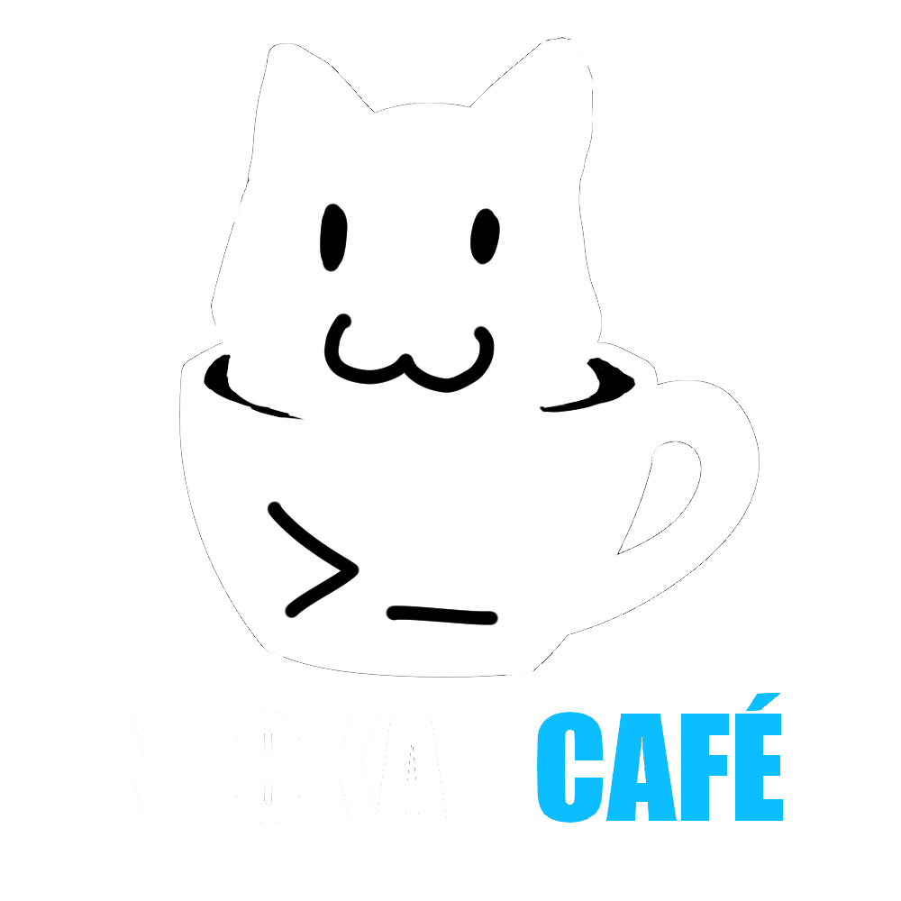

# Nome do jogo

## Um jogo por:

## Equipe
- Sigilchip
- Bell
- SucoDeArgila
- SrDoppelganger

## Sobre o jogo
_nome_do_jogo_ é um jogo point-and-click onde você joga como Cafelipe, um funcionário da tribumiau, que deve embarcar em uma jornada de tremendo tédio e burocracia para conseguir uma mera carimbada num documento.

### Classificação indicativa

## Créditos de Assets externos

| Asset | Tipo | Crédito | PLataforma |  Link |
|-------|----|---------| ----- | ----- |
| Godot Dialogue Manager | Plugin | Nathan Hoad | GitHub | https://github.com/nathanhoad/godot_dialogue_manager |
|  Bakso Sapi | Fonte de texto | Locomotype | Dafont | https://www.dafont.com/pt/bakso-sapi.font |
| Pixeled | Fonte de texto | OmegaPC777 | Dafont | https://www.dafont.com/pt/pixeled.font |
| traditional stamp | Efeito sonoro(Placeholder) | freesound_community | Pixabay | https://pixabay.com/pt/sound-effects/filme-e-efeitos-especiais-traditional-stamp-44189/ |
| yay |  Efeito sonoro(Placeholder) | freesound_community | Pixabay | https://pixabay.com/pt/sound-effects/pessoas-yay-6326/ |
| beep | Efeito sonoro(Placeholder) | u_s026io00zm | Pixabay | https://pixabay.com/pt/sound-effects/filme-e-efeitos-especiais-beep-401570/ |

